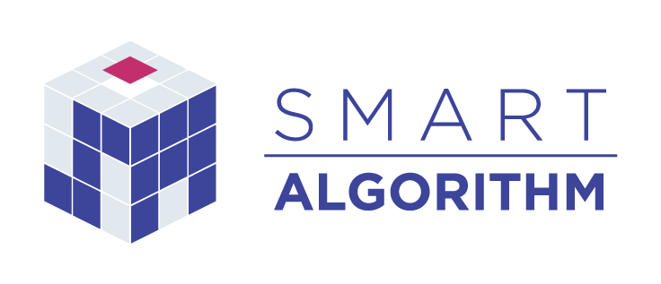

# 株式会社スマートアルゴリズム ホームページ



本リポジトリでは、株式会社スマートアルゴリズムのホームページを管理しています。

## 開発環境

本サイトは [Gatsby](https://www.gatsbyjs.com/) で作成されており、UIライブラリは [daisyUI](https://daisyui.com/) を使用しています。

### 必要なもの

- Node.js（バージョンは [.node-version](./.node-version) を参照）
- お使いのエディタで使用できる [EditorConfig](https://editorconfig.org/) のプラグイン

### セットアップ

```
npm install
```

### 起動

```
npm start
```

http://localhost:8000

## デプロイ

GitHub Actions によって、 `main` ブランチへのコミットが自動デプロイされます。

## 本リポジトリに含まれるリソースについて

- ソースコードについては、MITライセンスのもとでご自由にお使いいただけます。
- 画像については、原則として他でのご使用はご遠慮ください。

## 本サイトに関するお問い合わせ

本サイトについて気になったことがあれば、GitHub Issues にてご連絡ください。

※弊社の事業やシステム開発に関するご相談については、**GitHub Issues ではなく[ホームページ](https://smartalgorithm.co.jp)の「お問い合わせ」よりご連絡ください**。
